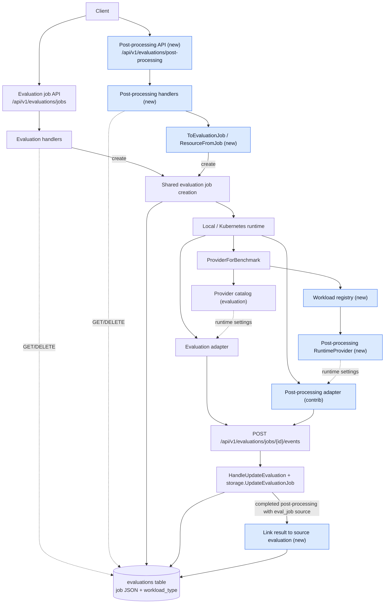
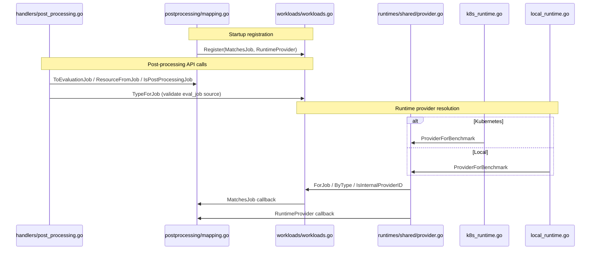

# EvalHub Server — repository architecture

This document describes how **this** repository is structured and how the EvalHub **server** and related binaries fit together at the code level.

For the **platform** view (how Server, SDK, Contrib, jobs, and registries relate), see the [EvalHub architecture overview](https://eval-hub.github.io/#architecture-overview) on the project site. User-facing setup, installation, and product features are documented at [eval-hub.github.io](https://eval-hub.github.io/); they are not repeated here.

---

## Scope of this repository

| Deliverable | Role |
|-------------|------|
| **`cmd/eval-hub`** | HTTP API process: configuration, routing, persistence, orchestration. |
| **`cmd/eval-runtime-sidecar`** | Sidecar used in evaluation job pods (proxy, readiness, termination). |
| **`cmd/eval-runtime-init`** | Init/helper container logic for job startup where applicable. |
| **`pkg/api`** | Shared API types used by handlers and persistence; aligned with **`api/`** (OpenAPI 3.1). |
| **`internal/eval_hub/**`** | Application implementation (not importable by external modules). |
| **`tests/features/**`** | Functional verification tests (godog) against a running server. |

The Python SDK, community adapters, and end-user tutorials live in **other** EvalHub projects; consume them via the [documentation site](https://eval-hub.github.io/).

---

## High-level request flow

1. **`cmd/eval-hub/main.go`** constructs the logger, loads config, builds the HTTP server, runs until shutdown (SIGINT/SIGTERM).
2. **`internal/eval_hub/server`** registers routes on `net/http.ServeMux`, applies middleware (metrics, CORS in local mode), and for API routes builds an **`ExecutionContext`** per request.
3. **`internal/eval_hub/handlers`** implements REST semantics: validation, storage calls, optional **MLflow** experiment setup, and delegation to a **`Runtime`** when a job should run.
4. **`internal/eval_hub/storage`** persists tenants’ evaluations, providers, collections, etc. The active backend is **SQL** (SQLite or PostgreSQL) behind **`abstractions.Storage`**.
5. **`internal/eval_hub/runtimes`** implements **`abstractions.Runtime`** (e.g. local processes, Kubernetes Jobs). Runtimes receive a narrow **`RuntimeStorage`** surface for `GetProvider` and benchmark status updates so orchestration stays decoupled from full storage access.

---

## Core abstractions (`internal/eval_hub/abstractions`)

- **`Storage`** — CRUD and queries for evaluation jobs, providers, collections, system scope vs tenant scope, `WithContext` / `WithTenant` / `WithOwner` chaining for request-scoped work.
- **`Runtime`** — `RunEvaluationJob` and `DeleteEvaluationJobResources`; selected at startup from service configuration.
- **`RuntimeStorage`** — Minimal storage face passed into runtimes: provider lookup and `UpdateEvaluationJob` (benchmark status events), so workers do not depend on the full `Storage` interface.

Domain types are largely **`pkg/api`** structs; errors to clients are shaped via **`internal/eval_hub/serviceerrors`** and **`internal/eval_hub/messages`**.

---

## ExecutionContext (`internal/eval_hub/executioncontext`)

Evaluation handlers take **`ExecutionContext`** (not raw `*http.Request` alone): request ID, tenant, user, logger, cancelable context, and service config. That keeps logging fields consistent and avoids threading globals. Basic routes (health, OpenAPI) may use plain `http` handlers.

In cluster deployments, **kube-rbac-proxy** performs authentication and authorization, then forwards API requests to eval-hub with **`X-Tenant`** (namespace) and **`X-User`** (authenticated identity). eval-hub requires both headers on evaluation API routes in cluster mode; **local mode** (`--local`) does not require them. **`GET /api/v1/health`** does not require identity headers (probe-friendly) and omits build/version fields. eval-hub does not validate Bearer tokens itself.

---

## Configuration (`internal/eval_hub/config`)

Viper loads **`config/config.yaml`** with overrides from environment variables and optional **secret files** (paths configured in YAML). Runtime mode (local vs Kubernetes), database DSN, MLflow, OpenTelemetry, and sidecar-related service settings are expressed here. See **`CLAUDE.md`** for day-to-day commands and config discovery notes.

---

## Persistence (`internal/eval_hub/storage/sql`)

- Single **SQL** implementation with **SQLite** and **PostgreSQL** dialects under `storage/sql/sqlite` and `storage/sql/postgres`; shared SQL building blocks live in **`storage/sql/shared`**.
- Evaluation job entities are JSON documents in tables, updated transactionally (status, per-benchmark progress, results, overall scoring when complete).

---

## Workloads (`internal/eval_hub/workloads`)

Every runnable workload is an **`EvaluationJobResource`** under the hood: its API maps a request to an `EvaluationJobConfig`, then uses the shared evaluation storage, status updates, and runtime. The [post-processing mapping](internal/eval_hub/postprocessing/mapping.go) shows both request-to-job and job-to-response conversion. The `evaluations.workload_type` column stores its type (`evaluation` by default; `post-processing` for standalone post-processing) when [SQL creates the job](internal/eval_hub/storage/sql/evaluations_crud.go). [`workloads.TypeForJob`](internal/eval_hub/workloads/workloads.go) identifies registered workloads from the stored job; an unmatched job is a conventional evaluation.

The APIs keep different contracts over that shared representation. `/api/v1/evaluations/jobs` accepts model and benchmark configuration and resolves providers from the catalog. `/api/v1/evaluations/post-processing` accepts operations and data references, stores them as parameters of one internal benchmark, then returns a post-processing resource. The server assigns internal provider and benchmark IDs; public evaluation requests cannot select them. Each API must restrict reads and deletes to its own workload, and evaluation lists must exclude other workloads.

### API and status flow for post processing workload

Blue nodes mark post-processing additions. Both workloads use the existing [status-event route](internal/eval_hub/server/server.go), [update handler](internal/eval_hub/handlers/evaluations.go), and [SQL status update](internal/eval_hub/storage/sql/evaluations_status.go); completed post-processing jobs with an `eval_job` source also use [SQL completion linking](internal/eval_hub/storage/sql/post_processing.go). The evaluation-job GET/DELETE routes still hide post-processing jobs.

### Post-processing code call relationships

The handler calls the mapping and registry directly. Both runtimes reach them through `shared.ProviderForBenchmark`, which looks up the registered workload and invokes its callbacks.

### Steps to add a new workload

For a server-managed workload outside the provider catalog, follow these steps:

1. Define a stable workload type and internal provider/benchmark IDs. Implement `MatchesJob`, register a `workloads.Workload` with `Internal: true` in `init()`, and import the package from runtime wiring. See the [post-processing registration and matcher](internal/eval_hub/postprocessing/mapping.go) and its [startup import](internal/eval_hub/runtimes/shared/provider.go). Types are persisted, and the IDs identify stored jobs. Unregistered jobs default to `evaluation`.
2. Implement `RuntimeProvider` to return an in-memory `ProviderResource` with settings for the supported runtime modes. See the [post-processing runtime provider](internal/eval_hub/postprocessing/mapping.go); [`ProviderForBenchmark`](internal/eval_hub/runtimes/shared/provider.go) uses it for registered workloads and the catalog for conventional evaluations.
3. Add workload-specific [API types](pkg/api/post_processing.go), [handlers](internal/eval_hub/handlers/post_processing.go), and [route registration](internal/eval_hub/server/server.go) that map requests to backing evaluation jobs and stored jobs back to the public response. Scope each exposed GET/DELETE/list route to its workload, and cover cross-API resource isolation in tests.

---

## Runtimes (`internal/eval_hub/runtimes`)

- **`local`** — Runs benchmarks as local processes (job spec on disk, process tracking, cancellation).
- **`k8s`** — Builds Job/ConfigMap (and related) resources; integrates with cluster helpers and **sidecar** configuration.
- **`shared`** — Shared job spec / serialization helpers usable from multiple runtimes.

Kubernetes **job pods** use **`sidecar_config.json`** (not the server’s main ConfigMap) for URLs, TLS, and tokens; paths such as readiness and termination files are defined in the sidecar binary. See **`CLAUDE.md`** for local sidecar dev pointers.

---

## Observability

- **`internal/eval_hub/metrics`** — Prometheus metric definitions (request counters, duration histograms). The metrics middleware wraps the main API router to record observations.
- **`internal/eval_hub/server/metrics_server.go`** — Dedicated HTTP server for Prometheus scraping. Serves **only** `/metrics` on a separate port (default 8081, configurable via `METRICS_PORT`) bound to `0.0.0.0`. This port is cluster-internal only (no Route, no auth) so that Prometheus can scrape without going through kube-rbac-proxy. In **local mode**, `/metrics` is additionally served on the main API router for FVT compatibility.
- **OpenTelemetry** — Optional tracing/metrics wiring from service config (`internal/eval_hub/config`, handler helpers as applicable).

Logging uses **slog** with **`internal/logging`** enriching logs from the incoming request (request ID, method, URI, etc.).

---

## API contract

- **`api/`** — OpenAPI 3.1 specification for the REST API.
- Handlers enforce validation and HTTP semantics consistent with that spec.

---

## Testing

| Layer | Location | Purpose |
|-------|----------|---------|
| **Unit / integration** | `internal/eval_hub/**/*_test.go` | Packages, handlers, storage, runtimes. |
| **FVT** | `tests/features/` | Gherkin features + godog steps against a real server process. |

---

## Related documentation

| Topic | Where |
|-------|--------|
| Platform & components | [Architecture overview](https://eval-hub.github.io/#architecture-overview) |
| End-user / SDK docs | [eval-hub.github.io](https://eval-hub.github.io/) |
| Build, DB, sidecar dev notes | **`CLAUDE.md`** (this repo) |
