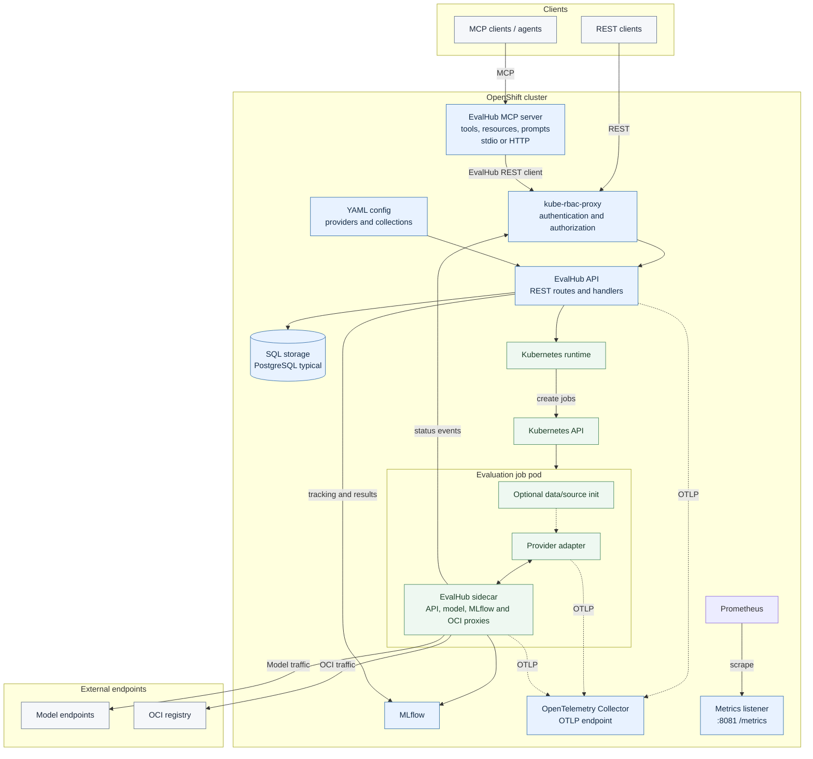
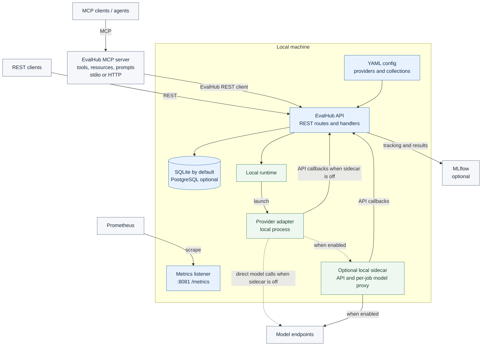

# EvalHub

[](https://go.dev)
[](https://github.com/eval-hub/eval-hub)
[](https://pkg.go.dev/github.com/eval-hub/eval-hub)
[](https://github.com/eval-hub/eval-hub/actions/workflows/ci.yml)
[](https://github.com/eval-hub/eval-hub/actions/workflows/golangci-lint.yml)
[](https://codecov.io/github/eval-hub/eval-hub)
[](https://github.com/eval-hub/eval-hub/actions/workflows/check-trustyai-service-operator-configmap-sync.yml)
[](https://github.com/eval-hub/eval-hub/blob/main/LICENSE)
[](https://github.com/eval-hub/eval-hub/actions/workflows/signed-release.yml)
[](https://scorecard.dev/viewer/?uri=github.com/eval-hub/eval-hub)
[](https://www.bestpractices.dev/projects/13751)
[](https://pypi.org/project/eval-hub-sdk/)
[](https://github.com/eval-hub/eval-hub-sdk/releases/latest)

A lightweight REST API service for orchestrating LLM evaluations across multiple backends. Written in Go, it routes evaluation requests to frameworks like lm-evaluation-harness, RAGAS, Garak, and GuideLLM orchestrated via a [complementary SDK](https://github.com/eval-hub/eval-hub-sdk), tracks experiments via MLflow, and runs natively on OpenShift.

## Architecture

### OpenShift architecture



OpenShift API requests pass through kube-rbac-proxy, which supplies the authenticated user and tenant identity. The API creates Kubernetes jobs; each job pod runs a provider adapter and sidecar. The sidecar proxies model, MLflow, OCI, and API callback traffic. Prometheus scrapes the dedicated metrics listener. The MCP server runs inside the cluster as a process separate from the API.

### Local architecture



Local mode connects directly to the API without kube-rbac-proxy and runs each adapter as a local process. The shared sidecar is optional; when enabled, it handles API callbacks and per-job model routing. MLflow can be configured for experiment tracking and result export. Prometheus can scrape the separate metrics listener; local mode also exposes `/metrics` on the API port. The MCP server is a separate process and can run near the MCP client or alongside the API.

## Quick start

### Prerequisites

- Go 1.26+
- Make
- Python 3 (for `make test`; used by scripts/grcat for colored output)
- [uv](https://docs.astral.sh/uv/) (manages the Python venv required by `make start-service` and FVT tests; run `make venv` to create it)
- Podman (for container builds)
- Access to an OpenShift or Kubernetes cluster (for deployment)

### Run locally

```bash
make install-deps
make build
./bin/eval-hub
```

Note that in some cases it may be necessary to exclude certain (newer) dependencies,
this can be done as shown below in the `go.mod` file:

```mod
exclude (
  k8s.io/api v0.36.0
)
```

The API is available at `http://localhost:8080`. Verify it is running:

```bash
curl http://localhost:8080/api/v1/health
```

Interactive documentation is served at `/docs`.

### Run in a container

```bash
podman build -t eval-hub:latest -f Containerfile .
podman run --rm -p 8080:8080 eval-hub:latest
```

### Deploy to OpenShift

EvalHub is managed by the [TrustyAI Service Operator](https://github.com/trustyai-explainability/trustyai-service-operator) via a custom resource:

```yaml
apiVersion: trustyai.opendatahub.io/v1alpha1
kind: EvalHub
metadata:
  name: evalhub
  namespace: my-namespace
spec:
  replicas: 1
  env:
    - name: MLFLOW_TRACKING_URI
      value: "http://mlflow:5000"
    - name: EVALHUB_HARDWARE_PROFILES_NAMESPACE
      value: "opendatahub"  # or redhat-ods-applications on RHOAI
```

Apply the CR to your cluster:

```bash
oc apply -f evalhub-cr.yaml
oc get evalhub -n my-namespace    # check status
```

## Local development

```bash
make start-service          # start in background (logs to bin/service.log)
make stop-service           # stop

make test                   # unit tests
make test-fvt               # BDD functional tests (godog)
make test-all               # both
make test-coverage          # generate coverage.html

make lint                   # go vet
make fmt                    # go fmt
```

For local post-processing, the runtime launches the real adapter from a sibling
`../eval-hub-contrib/adapters/evalhub-post-processor` checkout. Install that
adapter's `requirements.txt` in its `.venv` before starting EvalHub from this
repository root. For another checkout or Python environment, set
`EVALHUB_POST_PROCESSING_LOCAL_COMMAND` to the command that runs its `main.py`.
The adapter also needs a reachable callback service and access to the referenced
data; see the adapter's README for local setup.

Run a single test:

```bash
go test -v ./internal/handlers -run TestHandleName
```

To create a Python wheel distribution of the server for local development and testing:

```sh
make cross-compile
make build-wheel
```

### Quick local OCI evaluation card check

Developers can use `scripts/test-local-oci-export.sh` to simulate a quick OCI evaluation card
generation during development. It runs an evaluation with the local test adapter,
downloads the exported card from a local OCI registry, and verifies it against
the completed job. No model server is required.

Install these dependencies before starting:

- `curl`, `jq`, and `oras`, available on your `PATH`.
- Go (the version specified in `go.mod`) and `uv` for the service setup.
- A running container engine: Podman by default, or Docker with `DOCKER=docker`.

From the repository root, start the registry and service:

```sh
make start-oci-registry
make start-service
```

These targets start the registry at `localhost:5001` and build and start the
service in local mode at `http://localhost:8080`, including the test adapter setup.
For Docker, use `make start-oci-registry DOCKER=docker`.

Run the check:

```sh
bash scripts/test-local-oci-export.sh
```

A successful run prints a verification message and saves these files in
`./bin/local-oci/` by default:

| File | Contents |
| --- | --- |
| `request.json` | Submitted evaluation job request |
| `created.json` | Job creation response, including the job ID |
| `job.json` | Latest job status response, with results on completion |
| `manifest.json` | Exported OCI artifact manifest |
| `artifact-config.json` | OCI artifact configuration |
| `evaluation-card-<job-id>.json` | Downloaded evaluation card |

Set `OUTPUT_DIR` to save verification files elsewhere:

```sh
OUTPUT_DIR=/tmp/local-oci-check bash scripts/test-local-oci-export.sh
```

When finished, stop the service and remove the registry container:

```sh
make stop-service
make stop-oci-registry
```

If using Docker, use `make stop-oci-registry DOCKER=docker`.

### Exposing private functions for tests

Create a file called `export_test.go` in the package under test and re-export symbols needed by `_test.go` files in other packages.

### Database

SQLite in-memory is the default (`database.driver: sqlite` in `config/config.yaml`). To use PostgreSQL locally there are two approaches: a container or a native install. Both use targets in `tests/postgres/Makefile`.

> **Note:** The credentials and auth settings below are for local development and testing only. For production deployments, use strong passwords, TLS, and appropriate authentication mechanisms.

#### Option 1: Container (Podman/Docker)

No system-level install required. The container creates the database, user, and permissions automatically.

```bash
cd tests/postgres
POSTGRES_PASSWORD=<your-password> make start-postgres-container
```

To stop and remove:

```bash
cd tests/postgres
make stop-postgres-container
make delete-postgres-container
```

Configure EvalHub in `config/config.yaml`:

```yaml
database:
  driver: pgx
  url: postgres://eval_hub:<your-password>@localhost:5432/eval_hub
```

Or override via environment variables:

```bash
export DB_DRIVER=pgx
export DB_URL="postgres://eval_hub:<your-password>@localhost:5432/eval_hub"
```

#### Option 2: Native install (Homebrew on macOS, apt on Linux)

```bash
cd tests/postgres
make install-postgres
make start-postgres
make create-user
make create-database
make grant-permissions
```

To stop:

```bash
cd tests/postgres
make stop-postgres
```

Configure EvalHub in `config/config.yaml` (no password needed with trust/peer auth):

```yaml
database:
  driver: pgx
  url: postgres://eval_hub@localhost:5432/eval_hub
```

Or override via environment variables:

```bash
export DB_DRIVER=pgx
export DB_URL="postgres://eval_hub@localhost:5432/eval_hub"
```

## Configuration

Configuration is loaded from `config/config.yaml`, overridden by environment variables and secret files.

| Variable | Purpose | Default |
| --- | --- | --- |
| `PORT` | API listen port | `8080` |
| `DB_DRIVER` | Database driver (`sqlite` or `pgx`) | `sqlite` |
| `DB_URL` | Database connection string | SQLite in-memory |
| `MLFLOW_TRACKING_URI` | MLflow tracking server | `http://localhost:5000` |
| `MLFLOW_CA_CERT_PATH` | PEM CA bundle for MLflow TLS verification | (system roots) |
| `LOG_LEVEL` | Logging level | `INFO` |
| `EVALHUB_HARDWARE_PROFILES_NAMESPACE` | Platform namespace where OpenDataHub `HardwareProfile` CRs are fetched (Kubernetes runtime). Required for `hardware_config.hardware_profile_name` evaluations; typically `opendatahub` or `redhat-ods-applications`. Set by the TrustyAI Service Operator deployment. | _(unset — hardware profile lookups fail)_ |

Provider configurations live in `config/providers/` as YAML files. The default set includes lm-evaluation-harness (167 benchmarks), RAGAS, Garak, GuideLLM, LightEval, and MTEB.

### Syncing providers and collections to the TrustyAI operator

Provider and collection definitions are maintained here and mirrored as ConfigMaps in the [TrustyAI Service Operator](https://github.com/trustyai-explainability/trustyai-service-operator):

- Providers: `config/providers/` → `config/configmaps/evalhub/provider-*.yaml`
- Collections: `config/collections/` → `config/configmaps/evalhub/collection-*.yaml`

When adding or changing a provider or collection, update the source YAML in this repository and the corresponding embedded ConfigMap in the operator repository. Add new ConfigMaps to the operator's `config/configmaps/evalhub/kustomization.yaml`. Keep the two repositories' changes coordinated so the operator can deploy the same definitions.

The sync check compares the embedded ConfigMap YAML with the source files. Run it locally with:

```bash
python scripts/check_configmap_sync.py
```

The same check runs in CI through the [TrustyAI Operator ConfigMap Sync workflow](.github/workflows/check-trustyai-service-operator-configmap-sync.yml).

## API overview

All endpoints are versioned under `/api/v1`. Full specification at [eval-hub.github.io/eval-hub](https://eval-hub.github.io/eval-hub/).

| Endpoint | Methods | Description |
| --- | --- | --- |
| `/api/v1/evaluations/jobs` | POST, GET | Create or list evaluation jobs |
| `/api/v1/evaluations/jobs/{id}` | GET, DELETE | Get status or cancel a job |
| `/api/v1/evaluations/collections` | GET, POST | List or create benchmark collections |
| `/api/v1/evaluations/providers` | GET, POST | List or create providers |
| `/api/v1/evaluations/providers/{id}` | GET, PUT, PATCH, DELETE | Manage a provider |
| `/api/v1/evaluations/jobs/{id}/events` | POST | Submit job events |
| `/api/v1/health` | GET | Health check (no identity headers; no build/version fields) |
| `/metrics` | GET | Prometheus metrics |

Detailed API documentation: [eval-hub.github.io/eval-hub](https://eval-hub.github.io/eval-hub/)

## Custom backends

EvalHub supports Bring Your Own Framework (BYOF). Extend the `FrameworkAdapter` class from the [eval-hub-sdk](https://github.com/eval-hub/eval-hub-sdk) and implement a single method -- EvalHub handles scheduling, status reporting, and result aggregation.

```python
from evalhub.adapter import FrameworkAdapter, JobSpec, JobCallbacks, JobResults, EvaluationResult

class MyAdapter(FrameworkAdapter):
    def run_benchmark_job(self, config: JobSpec, callbacks: JobCallbacks) -> JobResults:
        # run your evaluation logic, report progress via callbacks
        callbacks.report_status(JobStatusUpdate(status=JobStatus.RUNNING, progress=0.5))
        score = evaluate(config.model, config.parameters)
        return JobResults(
            id=config.id,
            benchmark_id=config.benchmark_id,
            model_name=config.model.name,
            results=[EvaluationResult(metric_name="accuracy", metric_value=score)],
            num_examples_evaluated=100,
            duration_seconds=elapsed,
        )
```

Register the new provider by adding a YAML entry to the providers ConfigMap. No additional services or TCP listeners are required -- adapters run as jobs, not servers. Once registered, the provider and its benchmarks are available through the standard `/api/v1/evaluations/providers` endpoint.

## Project structure

```text
eval-hub/
├── cmd/eval_hub/          # Entry point (main binary)
├── internal/
│   ├── handlers/          # HTTP request handlers
│   ├── storage/           # Database abstraction (SQLite, PostgreSQL)
│   ├── mlflow/            # MLflow client
│   ├── runtimes/          # Backend execution adapters
│   ├── config/            # Viper-based configuration
│   ├── validation/        # Request validation
│   ├── metrics/           # Prometheus instrumentation
│   └── logging/           # Structured logging (zap)
├── config/                # config.yaml and provider definitions
├── docs/src/              # OpenAPI 3.1.0 specification (source of truth)
├── tests/features/        # BDD tests (godog)
├── Containerfile          # Multi-stage UBI9 container build
└── Makefile               # Build, test, and dev targets
```

## Local mode

EvalHub can run evaluations locally without a Kubernetes cluster. See the [local mode guide](https://eval-hub.github.io/guides/local-mode/) for configuration, architecture details, and troubleshooting, and the [local mode tutorial](https://eval-hub.github.io/guides/local-mode-tutorial/) for a step-by-step walkthrough. A self-contained [LightEval example](examples/local-lighteval/) is included in this repository.

When local mode has `mlflow.tracking_uri` configured, each local evaluation subprocess automatically receives that direct URI as `MLFLOW_TRACKING_URI`. Local subprocess environment variables are applied in this order, with later values replacing matching earlier values:

1. Inherited process environment
2. EvalHub and service configuration values
3. Provider `runtime.local.env` values

## Further reading

- [API documentation](https://eval-hub.github.io/eval-hub/) -- full endpoint reference
- [Local mode guide](https://eval-hub.github.io/guides/local-mode/) -- running evaluations without Kubernetes
- [CONTRIBUTING.md](./CONTRIBUTING.md) -- contribution guidelines
- [OpenAPI spec](./docs/openapi.yaml) -- machine-readable API definition

## Licence

Apache 2.0 -- see [LICENSE](./LICENSE).
